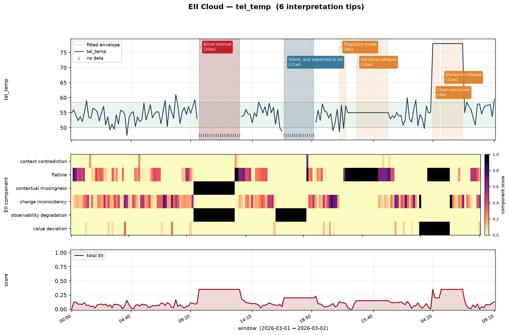

# tacet

**Observability-aware anomaly detection for HPC and distributed systems.**

*tacet* (Latin, "it is silent") is the direction in a musical score telling an
instrument not to play. In a monitoring system, silence is rarely an
instruction — it is usually the most important thing the system said, and almost
every tool built for the problem is designed not to hear it.

```bash
pip install tacet
```

---

## The problem

There are hundreds of anomaly-detection libraries. Nearly all of them ask one
question — *is this value abnormal?* — and when the value is missing, they impute
something plausible and carry on.

That is reasonable for a sensor on a bench. It is actively harmful in a
distributed system, where **the failure of the observer and the failure of the
observed are correlated events**. A GPU that overheats and takes its exporter
down with it produces no anomalous readings at all. A stuck sensor reports a
number that is in range and on time, forever. A node that drops out of a job
while the scheduler still counts it looks idle, and idle looks fine.

In each case the detector sees nothing wrong, because there is nothing left to
see. The signal is the absence.

## What tacet does differently

`tacet` asks a second question alongside the first: **could we see this at all,
and how much do we trust what came back?**

- **Missing samples are scored, not filled.** No forward-fill, no interpolation,
  no dropped empty scrapes — from the source adapters all the way through.
- **Coverage, gap structure and staleness become features.** Windowing
  manufactures an `obs_` evidence plane automatically, and detectors can train
  on it.
- **Every detector reports observability trust next to its score.** "Quiet and
  clearly observed" and "quiet and half blind" are the same number and opposite
  conclusions. They stop being the same answer.
- **Findings come with interpretation tips** — callouts that name the abnormal
  situation, explain how to read it on the chart, and say what to do.

On the bundled benchmark — six detectors, six seeds, detecting exporter outages,
stuck sensors and partial scrapes — adding the observability plane improves
average precision for **6 of 6 detectors**, by **+0.14 mean AP**:

| Detector | AP, telemetry only | AP, + observability | ROC-AUC |
|---|---|---|---|
| `MahalanobisDetector` | 0.189 | **0.384** | 0.637 → 0.829 |
| `FeatureGraphDetector` | 0.193 | **0.380** | 0.565 → 0.758 |
| `RobustZScore` | 0.242 | **0.378** | 0.606 → 0.719 |
| `MarkovDetector` | 0.181 | **0.332** | 0.517 → 0.705 |
| `CUSUMDetector` | 0.157 | **0.294** | 0.581 → 0.765 |
| `EWMADetector` | 0.150 | **0.182** | 0.532 → 0.718 |

Same detectors, same data, same budget — the only difference is whether the
model is allowed to see how well it was being observed. Reproduce with
`python examples/benchmark.py`.

---

## Quick start

```python
import tacet

# Any input. Offline files, a live endpoint, or a queue you push into.
telemetry, truth = tacet.datasets.make_cluster(seed=0)

# Windowing builds the observability plane: coverage, gaps, staleness.
windows = tacet.to_windows(
    telemetry, window="30min", stride="10min", expected_interval="1min"
)
windows["obs_coverage"].describe()

# Generate the EII Cloud.
cloud = tacet.EIICloud(
    parameters=["tel_gpu_temp_mean", "tel_sm_clock_mean"],
    expected_present="ctx_job_active_last",   # context: was work scheduled?
    high_load="ctx_high_load_last",
).fit_transform(windows)

# Ask it what it found, in words.
for tip in cloud.tips():
    print(tip.to_markdown())
```

```
🔴 Blind interval — the entity went quiet while it was supposed to be working
   `tel_gpu_temp_mean` from 2026-03-01 09:40 to 2026-03-01 13:00 (20 windows)

>  The cloud is dense here but the underlying metric line is absent. Samples
>  stopped arriving while context said this entity had work in flight. This is
>  not an idle period: it is a stretch of time you have no evidence about, and a
>  conventional dashboard would render it as a flat or interpolated line that
>  looks perfectly healthy.

What to do: Treat this window as unassessed rather than as normal. Check whether
the exporter, the agent, or the node itself stopped responding, and whether the
job scheduled here completed.
```

---

## The EII Cloud

An **Early Instability Indicator Cloud** is the full
`(window × parameter × component)` tensor of instability scores. Six components,
and which half of them is firing decides who gets paged:

| Component | High score means | Whose problem |
|---|---|---|
| `value_deviation` | reading left its expected envelope | the machine |
| `change_inconsistency` | legal value, abnormal rate of change | the machine |
| `flatline` | value arrives but has stopped moving | the sensor |
| `observability_degradation` | samples did not arrive | the pipeline |
| `contextual_missingness` | samples did not arrive **and were due** | the pipeline |
| `context_contradiction` | telemetry says idle, context says busy | either — establish order |

`contextual_missingness` is the one that carries the design. A node with nothing
scheduled reporting nothing is normal. A node the scheduler believes is running
a job reporting nothing is a monitoring failure, a hung agent, or a machine on
its way out. Without context, those are the same gap.

### Tips: the chart, annotated

`cloud.tips()` recognises characteristic signatures and returns callouts that
render on figures and into Markdown reports.

```python
from tacet.viz import plot_cloud, write_report

plot_cloud(cloud, tips=True, path="cloud.png")    # annotated
plot_cloud(cloud, tips=False, path="bare.png")    # just the data
write_report(cloud, "findings.md")                # tips as YAML front matter
```



The rule worth singling out is `UNTRUSTWORTHY_CALM`. Every other signature fires
on something visibly wrong. That one fires on a region that looks **healthy and
is not** — a stretch where the metric sat calmly inside its envelope while a
third of the samples behind it never arrived. Conventional monitoring cannot
draw that, because to a conventional monitor it is a good day.

---

## Inputs: offline, live, anything

Every source yields the same long frame, so code developed against a captured
dataset runs unchanged against a production stream.

```python
tacet.open_source("run.parquet", entity="node_id", time="ts")
tacet.open_source("/data/exadata/*.csv")                     # a directory
tacet.open_source(df)                                        # a DataFrame
tacet.open_source(lambda: read_nvidia_smi(), interval=15)    # any callable
tacet.open_source("prometheus://prom.hpc:9090", queries={
    "gpu_temp": "DCGM_FI_DEV_GPU_TEMP",
    "ecc_dbe":  "DCGM_FI_DEV_ECC_DBE_AGG_TOTAL",
}, entity_label="Hostname", step="30s")
```

`PushSource` for agents and webhooks, `ReplaySource` to replay a dataset as if
it were live. `PrometheusSource` reindexes onto the scrape grid so **missed
scrapes survive as `NaN`** — the query API returns only the points it has, which
silently erases exactly the evidence this library runs on.

## Detection

Markov, graph-convolutional, and classical baselines behind one interface.

```python
for name, factory in tacet.detect.REGISTRY.items():
    detector = factory(planes=["telemetry", "observability"]).fit(train)
    scored = detector.alert(detector.score(test), budget=200)
    results[name] = tacet.score_report(scored, budget=200)

print(tacet.compare(results))
```

| Detector | What it is for |
|---|---|
| `MarkovDetector` | discretised state transitions; surprise **and** level |
| `FeatureGraphDetector` | GCN-style propagation over a learned correlation graph |
| `MahalanobisDetector` | *combinations* that never occur healthy (broken couplings) |
| `RobustZScore` | median/MAD baseline — genuinely hard to beat |
| `EWMADetector` | slow drift and degradation |
| `CUSUMDetector` | sustained regime change too small to trip a threshold |

Set `trust_weighting="boost"` to promote windows you could *not* see — correct
when silence is the failure mode you are hunting.

## Analysis

```python
mapping = tacet.correlation_map(windows, method="spearman")
mapping.plane_summary()             # which evidence planes move together
mapping.observability_confounding() # metrics that track their own collection health

tacet.lead_lag(windows, target="eii_total", max_lag=24)   # what moves first
```

Six estimators — Pearson, Spearman, Kendall, partial, mutual information,
distance correlation — each reporting the supporting sample size, so a
correlation of 0.98 backed by nine points cannot quietly become a finding.

### Missingness analysis

```python
report = tacet.analyze_missingness(windows, label="label")

report.summary                  # rates, gap run-lengths, burstiness
report.mechanism                # MCAR / MAR / MNAR per column
report.co_missing_clusters()    # columns that fail together = shared collector
report.mcar_test                # Little's MCAR test
report.label_association        # does missingness predict the outcome?
```

Burstiness separates a metric losing 5% of samples uniformly from one losing 5%
in a single blackout — the same missing rate, completely different meanings. The
MNAR probe tests whether an observed value predicts that the *next* sample goes
missing: the fingerprint of a sensor that fails high, or a node that dies under
load.

## Evaluation

```python
report = tacet.score_report(scored, budget=200)
```

Standard metrics, plus:

- `blind_alert_rate` — share of alerts raised on windows you could barely see
- `blind_positive_rate` — failures whose evidence was never collected; the
  ceiling on what *any* detector could have found
- `mean_trust_at_alert`
- `f1_is_capped` — true when positives exceed the budget, so recall and F1 are
  bounded by the budget rather than by the model

`tacet.lead_time(scored)` reports how much warning each detection actually
bought, which is the number operators care about and papers usually omit.

Alert budgets are honoured **exactly**. The obvious implementation,
`score >= sorted(scores)[-budget]`, overshoots whenever scores tie — and anomaly
scores tie constantly. A budget of 50 becomes 8000 alerts, the extra alerts land
on real positives, and recall *improves*. The bug reads as a result.

---

## Install

```bash
pip install tacet                  # numpy + pandas only
pip install "tacet[viz]"           # + matplotlib
pip install "tacet[prometheus]"    # + requests
pip install "tacet[stats]"         # + scikit-learn, scipy
pip install "tacet[all]"
```

Python 3.9+. The core has no compiled dependencies and runs on a login node.

## Status

Beta. The API may shift before 1.0; the scoring semantics are settled.
Issues and contributions welcome.

## Citation

`tacet` generalises the EII Cloud framework developed for a study of silent GPU
degradation and predictive maintenance in HPC. If you use it in academic work,
please cite the repository until the accompanying paper appears.

## License

MIT. See [LICENSE](LICENSE).
